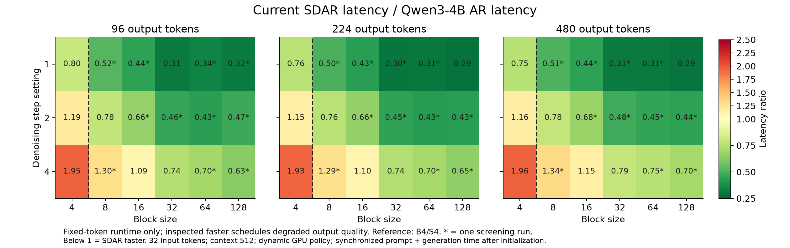

# SDAR vs AR on Snapdragon

## Goal

Find when optimized SDAR decoding becomes faster than AR as block size, denoising steps and output length change. We compare SDAR-4B-Chat and Qwen3-4B (Q4_K_M) on a Snapdragon 8 Gen 2 SoC, with a 32-token prompt and context size 512.

**These results do not demonstrate a speedup at comparable answer quality.** The experiment measures runtime for a fixed number of output token IDs; the faster inspected SDAR settings produced repeated, malformed or effectively empty text.

## How to run

### Compile on the host

From the repository root, apply the [measurement-only patch](measurement-only.patch) once, then run [compile.sh](compile.sh) with your own paths:

```sh
git apply benches/sdar-ar-crossover/measurement-only.patch
ANDROID_NDK=../android-ndk-r27d OPENCL_DIR=../opencl \
    sh benches/sdar-ar-crossover/compile.sh
```

<details>
<summary>Build prerequisites and options</summary>

The host needs CMake, Make, Git, Python 3 and an Android NDK (r27d was used for the recorded runs). Prepare an OpenCL directory with `include/CL/` headers and `lib/libOpenCL.so` for Android arm64.

Both dependency paths accept relative paths from the directory where you run the command. `BUILD_DIR` defaults to `build-android-sdar` in that directory; set `BUILD_DIR` and `JOBS` (default 8) to change the output directory and parallel build jobs. The script finds the source checkout from its own location and builds only `llama-diffusion-cli` and `llama-completion`, under `$BUILD_DIR/bin/`.

The patch adds prompt-token logging, synchronized timing, exact AR output counting and explicit causal attention for both AR controls. It changes three source files in the checkout; the script checks that it is applied before building. It changes no backend kernels or denoising schedule. After compiling, you can undo it with `git apply -R benches/sdar-ar-crossover/measurement-only.patch`.

</details>

### Run on the phone

On the prepared phone, run [reproduce.sh](reproduce.sh) in a rooted Android shell:

```sh
sh /data/local/tmp/sdar-ar-crossover-current/reproduce.sh
```

<details>
<summary>Phone setup, file locations and run behavior</summary>

The [reproduce.sh](reproduce.sh) script runs directly on the prepared phone. It expects these existing files:

| Directory | Files |
|---|---|
| `/data/local/tmp/sdar-ar-crossover-current/` | `reproduce.sh`, `llama-diffusion-cli`, `llama-completion` |
| `/mnt/nvme/` | `SDAR-4B-Chat-Q4_K_M.gguf`, `Qwen3-4B-Q4_K_M.gguf` |

Copy the two executables from `build-android-sdar/bin/` (or your chosen build directory) and `reproduce.sh` to the directory above.

The script uses the same inference arguments and repeat counts as the measured experiments: 169 grid/control runs and three separate Qwen direct-answer checks. It groups runs by setting, waits until all thermal-zone readings are at most 42 C before each run, and writes one log per run under `/mnt/nvme/sdar-ar-crossover-<timestamp>-<pid>/`. The log names contain the model, block size, step count, output length, repeat and Flash Attention setting where applicable.

Use the prepared device with its fan and keep-awake lock active, no concurrent inference, OpenCL profiling disabled, and the dynamic `msm-adreno-tz` GPU policy with limits of 124.8-680 MHz. The script retains the simple commands and loops; it does not collect telemetry or change the device policy. The figures below come from the original shuffled, interleaved and monitored runs. The simplified script has been checked for shell syntax, matching arguments and repeat counts, and unique log names; the full benchmark has not been rerun with it.

</details>

<details>
<summary>Full settings, timing method and model-size control</summary>

Measurements use revision `22273d99cad10230e8f22fe194ac958a6bda48f8` from the revised SDAR optimization series.

| Setting | Value |
|---|---|
| Device | Snapdragon 8 Gen 2 SoC |
| Models | SDAR-4B-Chat and Qwen3-4B, both Q4_K_M |
| Input | Identical 32-token ChatML input in the main comparison |
| Output lengths | 96, 224, 480; short checks at 16, 32, 40, 64 |
| SDAR blocks / steps | Blocks 4, 8, 16, 32, 64, 128; steps 1, 2, 4 |
| Backend | OpenCL, all 37 layers offloaded, F16 KV, Flash Attention auto |
| Context / batch / microbatch | 512 / 512 / 512 |
| Sampling | Greedy, temperature 0, seed 1, fixed output count, EOS ignored |
| CPU threads | 8 |

Timing includes prompt processing, generation, sampling and all SDAR KV commits, with synchronization before stopping the timer. Model loading, context initialization and cooling are excluded. AR produces N tokens using one prompt evaluation and N-1 cached decoding calls. Its last sampled token does not require another decode call.

The model labels do not imply identical parameter counts: SDAR stores 4,411,424,256 parameters, while Qwen stores 4,022,468,096. SDAR has an additional 388,956,160-parameter input embedding. Both have the same transformer dimensions. Causal decoding of the identical SDAR checkpoint provides an exact-size runtime control; it is not a quality-equivalent deployed AR model.

</details>

## Results

The figure shows **SDAR latency / Qwen AR latency**: below 1 favors SDAR. An asterisk marks a cell with one screening run.



The smallest tested winning blocks are below. Table speedup is **AR median time / SDAR median time** (the inverse of the figure's ratio).

| Denoising steps | First winning block | Speedup at 96 output tokens | At 224 | At 480 |
|---|---|---|---|---|
| 1 | 4 | 1.25x | 1.32x | 1.33x |
| 2 | 8 | 1.28x | 1.32x | 1.28x |
| 4 | 32 | 1.35x | 1.36x | 1.27x |

[results.csv](results.csv) contains all 77 grid/control cell summaries.

<details>
<summary>Detailed timings, repeats, short-output crossover and additional controls</summary>

The crossover neighbors, reference setting and fastest setting per output length have three repeats. Primary AR controls have four repeats per model and output length. Each winning cell's observed range is below the corresponding AR range; these ranges are not confidence intervals.

With four denoising steps, block 16 still loses and block 32 wins. For 224 output tokens, Qwen AR takes **21.592 s**, SDAR B32/S4 takes **15.909 s**, and the model-card reference B4/S4 takes **41.691 s**. The reference B4/S4 takes **1.93-1.96x AR time** across the three primary lengths. The identical-checkpoint AR control confirms the same block-size crossover.

For short outputs, B4/S1 approaches break-even near 32 output tokens and has a clear advantage by 40, with the same 32-token input:

| Output tokens | Qwen AR median, seconds | SDAR B4/S1 median, seconds | Observation |
|---|---|---|---|
| 16 | 1.747 | 2.126 | SDAR loses |
| 32 | 3.223 | 3.160 | Observed ranges overlap |
| 40 | 3.986 | 3.684 | SDAR wins against both AR controls |
| 64 | 6.252 | 5.283 | SDAR wins against both AR controls |

At block 4, SDAR prefills the 32-token prompt with eight block forwards, while AR uses one prompt evaluation. This startup cost affects short-output break-even. At blocks 64 and 128, the prompt partly fills the first block and its masks can be exhausted before the configured maximum number of steps. Block 32 is prompt-aligned and executes all four requested denoising passes in the four-step crossover result.

Additional checks do not change the crossover: Qwen without reasoning output differs from the main AR medians by +0.90%, -1.03% and +0.33% at 96, 224 and 480 tokens. At 224 tokens, Qwen with Flash Attention disabled has a median of 21.167 s versus 21.592 s with auto; the observed ranges overlap and the winning blocks stay 4, 8 and 32. Disabling Flash Attention for SDAR B128/S1 at 480 tokens lowers its median from 14.061 s to 13.364 s. These optional settings are kept separate from the main figure.

The CSV includes medians, observed ranges, repeat counts and ratios against both AR controls. The three direct-answer checks are summarized separately above. The original 169 grid/control runs passed token-count, prompt-ID, binary-hash, GPU-offload and telemetry checks. All recorded throttling values were zero; GPU clocks were dynamic, not pinned.

</details>

## Main conclusions

1. **SDAR crosses AR runtime at blocks 4, 8 and 32 for 1, 2 and 4 steps**, respectively, across the tested primary output lengths. These thresholds apply to this prompt and context size.
2. **Wider blocks improve weight reuse and amortize model calls.** Four denoising steps still require five forwards including the KV commit.
3. **The reference B4/S4 setting takes 1.93-1.96x AR time.** Faster settings change the generation schedule and have not established a useful-answer speedup.

<details>
<summary>Work per block and output-quality observations</summary>

Four denoising steps plus a KV commit require five block forwards. B4/S4 performs those five forwards per four output tokens; B32/S4 performs them per 32 output tokens. Wider execution improves weight reuse, while the repeated computation remains. Reducing the step count or enlarging the block changes the generation schedule and requires output validation.

In inspected 96-token samples, B4/S1 repeats fragments such as `of of of of`, B8/S2 produces malformed sentences, and B32/S4 detokenizes to only `.`. The model-card reference B4/S4 produces readable prose. Factual accuracy was not scored. SDAR can retain hidden EOS tokens when continuing to the requested length, so a fixed token-ID count does not imply equal useful text.

The main Qwen prefix produces reasoning tokens, which count toward its output budget. The separate direct-answer checks use a different, still 32-token prefix. These measurements establish fixed-token decoder runtime, not time to complete a task at matched answer quality, and do not establish the crossover for longer prompts or contexts.

</details>
